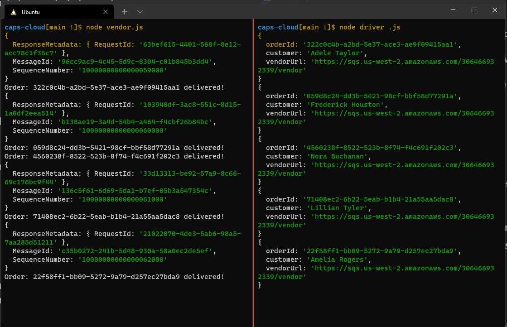
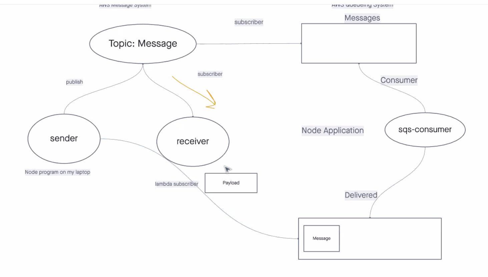

# Caps-Cloud

Authors:  Tanner Percival & Andres Mills Galleg0

## Lab 19

- We rebuilt the Caps server using AWS.
- Set intervals to simulate real life orders

## Instructions

You can get started by cloning down this repo, then running

`npm i`

You will need to set the app up with your own `SNS` and `SQS` products.

Then open up two terminals side by side and run:

`node vendor.js`

then 

`node driver.js`

The code is set up to randomize the "order" (payload) from the vendor and is sent every 8 seconds.  

Upon receipt, the driver sends a message to the appropriate, corresponding vendor queue who then receives the message and logs it.

## Featured Tasks

- `vendor.js` 
  - Should be an SQS Subscriber
  - Connect it to the pickup topic by using it’s URL/ARN
  - Set it up to produce a new message to the “pickup” topic every few seconds, simulating an order
  - The order id and customer name can be randomized
  - Include the ARN to the vendor’s personal delivery queue
  - Connect it to their own vendor queue by using it’s URL/ARN
  - As drivers deliver, this app will continually poll the queue, retrieve them, and log details out to the console
  - You should be able to disconnect this app, and see deliveries that happened while the app was not running

- `driver.js`
  - Connect to the pickup queue and get only the next package
  - Wait a random number of seconds
  - Post a message to the Vendor’s “delivered” Queue (using the supplied arn in the order/message) to alert them of the delivery
  - Repeat until the queue is empty

## Dependencies and Tools

- `SNS`
- `SQS`
- `Chance`
- `sqs-consumer`
- `sqs-producer`
- `aws-sdk`

## UML

## Link to PR

[Lab 19 PR](https://github.com/AndresMillsGallego/caps-cloud/pull/2)